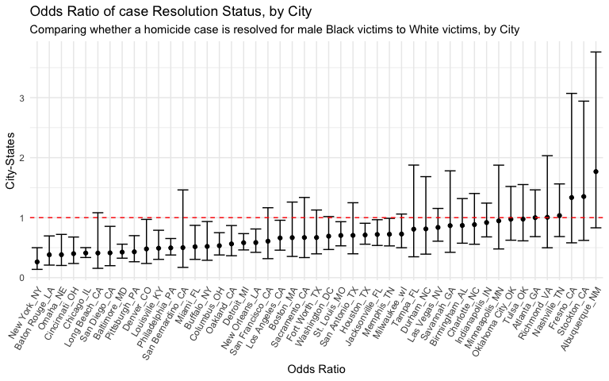
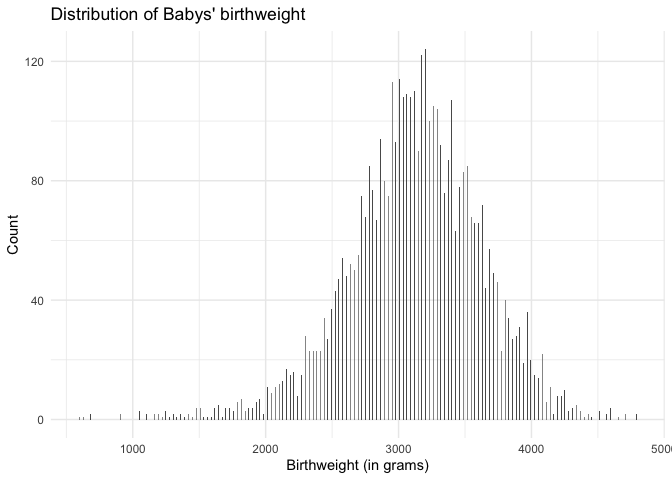
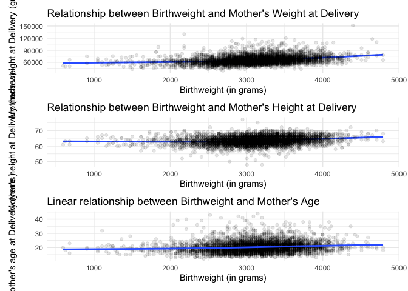
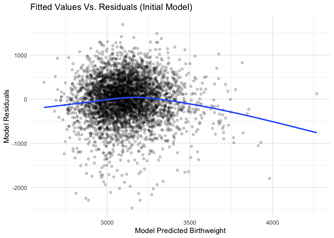

HW\_6
================
Binyam Yilma

Import & Filter Data

``` r
homicide_df = 
  read_csv("./data/homicide-data.csv", na = c("", "NA", "Unknown")) %>% 
  mutate(
    city_state = str_c(city, state, sep = "_"),
    resolution = case_when(
      disposition == "Closed without arrest" ~ 0,
      disposition == "Open/No arrest"        ~ 0,
      disposition == "Closed by arrest"      ~ 1,
    ),
    victim_age = as.numeric(victim_age)
  ) %>% 
  filter(!city_state %in% c("Tulsa_AL", "Dallas_TX", "Phoenix_AZ","Kansas City_MO"))  %>% 
  filter(victim_race %in% c("Black", "White")) %>% 
  filter(victim_sex %in% c("Male", "Female")) %>%  
  select(city_state, resolution, victim_age, victim_race, victim_sex)
```

#### Fit a logistic regression in Baltimore\_MD

``` r
baltimore_logitstic = homicide_df %>% 
  filter(city_state == "Baltimore_MD") %>% 
glm(resolution ~ victim_age + victim_sex + victim_race, family = binomial() , data = .) %>%
  broom::tidy() %>% 
  mutate(
    odds_ratio = exp(estimate),
    ci_lower =  exp(estimate - 1.96 * std.error),
    ci_upper = exp(estimate + 1.96 * std.error)
  ) %>% 
  select(term, odds_ratio, starts_with("CI")) %>% 
  knitr::kable(digits = 3)
```

#### Fit a logistic regression on all the cities

``` r
models_results = homicide_df %>% 
  mutate(victim_race = fct_relevel(victim_race, "White")) %>% #reordering to compare black victims to white victims
  nest(data = -city_state) %>% 
  mutate(
    models = map(.x = data, ~ glm(resolution ~ victim_age + victim_sex + victim_race, data = .x, family = binomial())),
    results = map(models, broom::tidy)
  ) %>% 
  select(city_state, results) %>% 
  unnest(results) %>% 
  mutate(
    odds_ratio = exp(estimate),
    ci_lower =  exp(estimate - 1.96 * std.error),
    ci_upper = exp(estimate + 1.96 * std.error)
  ) %>% 
  select(term, odds_ratio, starts_with("CI"))
```

#### Plot the estimated Odds Ratios and CIs for each city

``` r
models_results %>% 
  filter(term == "victim_sexMale") %>% 
  mutate(city_state = fct_reorder(city_state, odds_ratio)) %>% 
  ggplot(aes(x = city_state, y = odds_ratio)) + 
  geom_point() + 
  geom_errorbar(aes(ymin = ci_lower, ymax = ci_upper)) +
 theme(axis.text.x = element_text(angle = 60, vjust = 1.0, hjust = 1), legend.position = "none") + 
 geom_hline(yintercept=1, linetype="dashed", color = "red", size=0.5) +
  labs(
    title = "Odds Ratio of case Resolution Status, by City",
    subtitle  = "Comparing whether a homicide case is resolved for male Black victims to White victims, by City",
    x = "Odds Ratio",
    y = "City-States"
  )  
```

<!-- -->

The estimated odds of a homicide case being resolved for male Black
victims compared to the estimated odds of a homicide case being resolved
for White victims is lowest is New York City, NY (with evidence of
statistical significance); and highest in Albuquerque New Mexico,
although this is not statistical significant. The former observation
means that in New York City (as well as Baton Rouge, Louisiana; Omaha,
Nebraska; Chicago, Illinois, and others whose Odds Ratio & and their 95%
confidence interval is well below the dashed red line), if the homicide
victims are Black, the likelihood that that case will be resolved is
lower than if they were a white victim. However, this observation
doesn’t hold true in Boston, MA, Tampa, Florida, Atlanta, Georgia and
other city-states whose odds ration and 95% confidence interval either
crosses or is above the null value of odds ratio = 1 (indicated by the
dashed red line.)

## Problem 2

``` r
baby_df = 
  read_csv("./data/birthweight.csv") %>%
  mutate(
    babysex = ifelse(babysex == 1, "male", "female") %>% as.factor(),
    frace = 
      case_when(
        frace == 1 ~ "White",
        frace == 2 ~ "Black",
        frace == 3 ~ "Asian",
        frace == 4 ~ "Puerto Rican",
        frace == 8 ~ "Other",
        frace == 9 ~ "Unknown",
        TRUE ~ ""
      ) %>% as.factor(),
    mrace = 
      case_when(
        mrace == 1 ~ "White",
        mrace == 2 ~ "Black",
        mrace == 3 ~ "Asian",
        mrace == 4 ~ "Puerto Rican",
        mrace == 8 ~ "Other",
        TRUE ~ ""
      ) %>% as.factor(),
    delwt = delwt*453.592 %>% round(2)
  )
```

    ## Parsed with column specification:
    ## cols(
    ##   .default = col_double()
    ## )

    ## See spec(...) for full column specifications.

Tidying steps:

  - 1 Convert `babysex` to a `factor`
  - 2 Label Father’s race, and convert to `factor`
  - 3 Label Mother’s race, and convert to `factor`
  - 4 Convert Mother’s weight at delivery to `grams` to keep it
    consistent with baby’s `birthweight`

Checking for missing values

``` r
baby_df %>% skimr::skim() %>% select(skim_variable, n_missing, complete_rate) %>% knitr::kable()
```

| skim\_variable | n\_missing | complete\_rate |
| :------------- | ---------: | -------------: |
| babysex        |          0 |              1 |
| frace          |          0 |              1 |
| mrace          |          0 |              1 |
| bhead          |          0 |              1 |
| blength        |          0 |              1 |
| bwt            |          0 |              1 |
| delwt          |          0 |              1 |
| fincome        |          0 |              1 |
| gaweeks        |          0 |              1 |
| malform        |          0 |              1 |
| menarche       |          0 |              1 |
| mheight        |          0 |              1 |
| momage         |          0 |              1 |
| parity         |          0 |              1 |
| pnumlbw        |          0 |              1 |
| pnumsga        |          0 |              1 |
| ppbmi          |          0 |              1 |
| ppwt           |          0 |              1 |
| smoken         |          0 |              1 |
| wtgain         |          0 |              1 |

None of the variables contain missing values

#### Proposing an initial model for birthweight

Hypothesis driving proposed model:

An infant’s overall health depends on the overall health status of the
mother and the mother’s physical ability (without considering
sociodemographic factors) play important roles in determining the baby’s
health, and indeed the baby’s birthweight. I will treat three factors as
proxies of the mother’s health status and physical ability: mother’s
weight, height, and age.

Therefore, I hypothesize that a baby’s birhtweight can eb explained by a
mother’s weight, adjusting for height and age. I propose to fit a linear
model describing this relationship, after assessing the linearity and
normality assumption.

**Normality Assumption** Plot the distribution of our outcome variable -
`birthweight`

``` r
baby_df %>% 
  ggplot(aes(x = bwt)) +
  geom_histogram(binwidth = 5) + 
  labs(
    title = "Distribution of Babys' birthweight",
    y = "Count",
    x = "Birthweight (in grams)"
  )
```

<!-- --> The
histogram of a baby birthweight in the data follows a normal
distribution as shown above.

So, initially, we will fit a linear regression, which regresses
birthweight on mother’s weight at delivery (`delwt`) and mother’s height
(`mheight`). But before we do that, we will first the linearity
assumption of a linear regression by plotting a scatter plot between the
outcome variable `birthweight` and these two proposed predictors.

**Linearity Assumption**

``` r
bwt_delwt = baby_df %>% 
  ggplot(aes(x = bwt, y = delwt)) + 
  geom_smooth(se = F) + 
  geom_point(alpha = 0.1) + 
    labs(
    title = "Relationship between Birthweight and Mother's Weight at Delivery ",
    y = "Mother's weight at Delivery (grams)",
    x = "Birthweight (in grams)"
  )

bwt_mheight = baby_df %>% 
  ggplot(aes(x = bwt, y = mheight)) + 
  geom_smooth(se = F) + 
  geom_point(alpha = 0.1) + 
  labs(
    title = "Relationship between Birthweight and Mother's Height at Delivery ",
    y = "Mother's height at Delivery (inches)",
    x = "Birthweight (in grams)"
  )


bwt_momage = baby_df %>% 
  ggplot(aes(x = bwt, y = momage)) + 
  geom_point(alpha = 0.1) + 
  geom_smooth(se = F) + 
    labs(
    title = "Linear relationship between Birthweight and Mother's Age",
    y = "Mother's age at Delivery (years)",
    x = "Birthweight (in grams)"
  )


bwt_delwt / bwt_mheight / bwt_momage 
```

    ## `geom_smooth()` using method = 'gam' and formula 'y ~ s(x, bs = "cs")'
    ## `geom_smooth()` using method = 'gam' and formula 'y ~ s(x, bs = "cs")'
    ## `geom_smooth()` using method = 'gam' and formula 'y ~ s(x, bs = "cs")'

<!-- -->

In assessing the linearity assumption between birth-weight and mother’s
`weight & height`, we see that there is a slight curve around 2000-2500
grams of a baby’s birth-weight. But both relationship are mostly linear,
so I will assume that linearity has been maintained here for our initial
model. The relationship between birth-weight and mother’s age, also
appears to be mostly linear, with birthweight increasing with an
increase in mother’s age. I’ll assume that the linearity assumption has
been met here, as well.

\#\#\#\#Fitting a linear model

``` r
lin_fit = 
  baby_df %>% 
lm(bwt ~ delwt + mheight + momage, data = .) 
```

model summary

``` r
lin_fit %>% 
  broom::glance() %>% 
  knitr::kable(digits = 2)
```

| r.squared | adj.r.squared |  sigma | statistic | p.value | df |     logLik |      AIC |      BIC |   deviance | df.residual | nobs |
| --------: | ------------: | -----: | --------: | ------: | -: | ---------: | -------: | -------: | ---------: | ----------: | ---: |
|       0.1 |           0.1 | 485.73 |    162.69 |       0 |  3 | \-33017.17 | 66044.34 | 66076.22 | 1023497467 |        4338 | 4342 |

model estimates

``` r
lin_fit %>% 
  broom::tidy() %>% 
  knitr::kable(digits = 3)
```

| term        | estimate | std.error | statistic | p.value |
| :---------- | -------: | --------: | --------: | ------: |
| (Intercept) | 1030.701 |   179.499 |     5.742 |       0 |
| delwt       |    0.013 |     0.001 |    15.668 |       0 |
| mheight     |   15.131 |     3.056 |     4.951 |       0 |
| momage      |   14.381 |     1.914 |     7.515 |       0 |

Plottiing residuals vs. fitted values

``` r
baby_df %>%  
  add_residuals(lin_fit) %>% 
  add_predictions(lin_fit) %>% 
  ggplot(aes(x = pred, y = resid)) + 
  geom_point(alpha = .2) + 
  labs(
    title = "Fitted Values Vs. Residuals (Linear Model)",
    x = "Model Predicted Birthweight",
    y = "Model Residuals"
  )
```

<!-- -->
