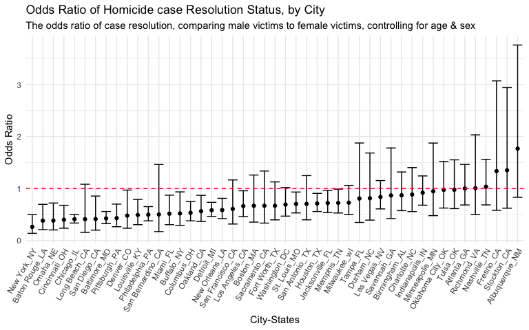
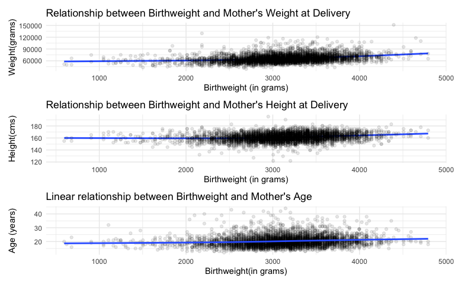
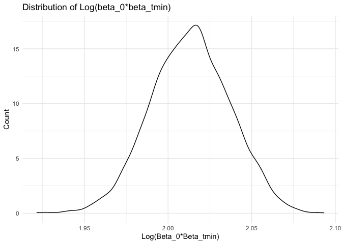

HW\_6
================
Binyam Yilma

## Problem 1

Import & Filter Data

``` r
homicide_df = 
  read_csv("./data/homicide-data.csv", na = c("", "NA", "Unknown")) %>% 
  mutate(
    city_state = str_c(city, state, sep = "_"),
    resolution = case_when(
      disposition == "Closed without arrest" ~ 0,
      disposition == "Open/No arrest"        ~ 0,
      disposition == "Closed by arrest"      ~ 1,
    ),
    victim_age = as.numeric(victim_age)
  ) %>% 
  filter(!city_state %in% c("Tulsa_AL", "Dallas_TX", "Phoenix_AZ","Kansas City_MO"))  %>% 
  filter(victim_race %in% c("Black", "White")) %>% 
  filter(victim_sex %in% c("Male", "Female")) %>%  
  select(city_state, resolution, victim_age, victim_race, victim_sex)
```

#### Fit a logistic regression in Baltimore\_MD

``` r
baltimore_logitstic = homicide_df %>% 
  filter(city_state == "Baltimore_MD") %>% 
glm(resolution ~ victim_age + victim_sex + victim_race, family = binomial() , data = .) %>%
  broom::tidy() %>% 
  mutate(
    odds_ratio = exp(estimate),
    ci_lower =  exp(estimate - 1.96 * std.error),
    ci_upper = exp(estimate + 1.96 * std.error)
  ) %>% 
  select(term, odds_ratio, starts_with("CI")) %>% 
  knitr::kable(digits = 3)

baltimore_logitstic
```

| term              | odds\_ratio | ci\_lower | ci\_upper |
| :---------------- | ----------: | --------: | --------: |
| (Intercept)       |       1.363 |     0.975 |     1.907 |
| victim\_age       |       0.993 |     0.987 |     1.000 |
| victim\_sexMale   |       0.426 |     0.325 |     0.558 |
| victim\_raceWhite |       2.320 |     1.648 |     3.268 |

#### Fit a logistic regression on all the cities

``` r
models_results = homicide_df %>% 
  #mutate(victim_race = fct_relevel(victim_race, "White")) %>% #reordering to compare black victims to white victims
  nest(data = -city_state) %>% 
  mutate(
    models = map(.x = data, ~ glm(resolution ~ victim_age + victim_sex + victim_race, data = .x, family = binomial())),
    results = map(models, broom::tidy)
  ) %>% 
  select(city_state, results) %>% 
  unnest(results) %>% 
  mutate(
    odds_ratio = exp(estimate),
    ci_lower =  exp(estimate - 1.96 * std.error),
    ci_upper = exp(estimate + 1.96 * std.error)
  ) %>% 
  select(term, odds_ratio, starts_with("CI"))
```

#### Plot the estimated Odds Ratios and CIs for each city

``` r
models_results %>% 
  filter(term == "victim_sexMale") %>% 
  mutate(city_state = fct_reorder(city_state, odds_ratio)) %>% 
  ggplot(aes(x = city_state, y = odds_ratio)) + 
  geom_point() + 
  geom_errorbar(aes(ymin = ci_lower, ymax = ci_upper)) +
 theme(axis.text.x = element_text(angle = 60, vjust = 1.0, hjust = 1), legend.position = "none") + 
 geom_hline(yintercept=1, linetype="dashed", color = "red", size=0.5) +
  labs(
    title = "Odds Ratio of Homicide case Resolution Status, by City",
    subtitle  = "The odds ratio of case resolution, comparing male victims to female victims, controlling for age & sex",
    y = "Odds Ratio",
    x = "City-States"
  )  
```

<!-- -->

The estimated odds of a homicide case being resolved for male victims
compared to the estimated odds of a homicide case being resolved for
female victims is lowest is New York City, NY (with evidence of
statistical significance), adjusting for race, age; and highest in
Albuquerque New Mexico, although this is not statistical significant.
The former observation means that in New York City (as well as Baton
Rouge, Louisiana; Omaha, Nebraska; Chicago, Illinois, and others whose
Odds Ratio & and their 95% confidence interval is below the dashed red
line), if the homicide victims are males, the likelihood that that case
will be resolved is lower than if they were a female victim. However,
this observation doesn’t hold true in Boston, MA, Tampa, Florida,
Atlanta, Georgia and other city-states whose odds ration and 95%
confidence interval either crosses or is above the null value of odds
ratio = 1 (indicated by the dashed red line.)

## Problem 2

``` r
baby_df = 
  read_csv("./data/birthweight.csv") %>%
  mutate(
    babysex = ifelse(babysex == 1, "male", "female") %>% as.factor(),
    frace = 
      case_when(
        frace == 1 ~ "White",
        frace == 2 ~ "Black",
        frace == 3 ~ "Asian",
        frace == 4 ~ "Puerto Rican",
        frace == 8 ~ "Other",
        frace == 9 ~ "Unknown",
        TRUE ~ ""
      ) %>% as.factor(),
    mrace = 
      case_when(
        mrace == 1 ~ "White",
        mrace == 2 ~ "Black",
        mrace == 3 ~ "Asian",
        mrace == 4 ~ "Puerto Rican",
        mrace == 8 ~ "Other",
        TRUE ~ ""
      ) %>% as.factor(),
    mrace = fct_relevel(mrace, "Other"),
    delwt = delwt*453.592 %>% round(2),
    mheight = mheight*2.54 %>% round(2)
  )
```

Tidying steps:

  - 1 Convert `babysex` to a `factor`
  - 2 Label Father’s race, and convert to `factor`
  - 3 Label Mother’s race, and convert to `factor`
  - 4 Convert Mother’s weight at delivery to `grams` to keep it
    consistent with baby’s `birthweight`
  - 5 Convert Mother’s height to `centimeters` to keep it consistent
    with baby’s length at birth

Checking for missing values

``` r
baby_df %>% skimr::skim() %>% select(skim_variable, n_missing, complete_rate) %>% knitr::kable()
```

| skim\_variable | n\_missing | complete\_rate |
| :------------- | ---------: | -------------: |
| babysex        |          0 |              1 |
| frace          |          0 |              1 |
| mrace          |          0 |              1 |
| bhead          |          0 |              1 |
| blength        |          0 |              1 |
| bwt            |          0 |              1 |
| delwt          |          0 |              1 |
| fincome        |          0 |              1 |
| gaweeks        |          0 |              1 |
| malform        |          0 |              1 |
| menarche       |          0 |              1 |
| mheight        |          0 |              1 |
| momage         |          0 |              1 |
| parity         |          0 |              1 |
| pnumlbw        |          0 |              1 |
| pnumsga        |          0 |              1 |
| ppbmi          |          0 |              1 |
| ppwt           |          0 |              1 |
| smoken         |          0 |              1 |
| wtgain         |          0 |              1 |

None of the variables contain missing values

#### Proposing an initial model for birthweight

Hypothesis driven approach to build a model:

An infant’s overall health depends on the overall health status of the
mother and the mother’s physical ability (without considering
sociodemographic factors) play important roles in determining the baby’s
health, and indeed the baby’s birthweight. I will treat three factors as
proxies of the mother’s health status and physical ability: mother’s
`weight`, `height`, and `age`.

Therefore, I hypothesize that a baby’s `birhtweight` can be explained by
a linear relationship to a mother’s `weight`, adjusting for `height` and
`age`. I propose to build a linear model that attempts to describe this
relationship.

First, I will assess the linearity and normality assumption a `linear`
model makes.

**Normality Assumption** Plot the distribution of our outcome variable -
`birthweight`

``` r
baby_df %>% 
  ggplot(aes(x = bwt)) +
  geom_histogram(binwidth = 5) + 
  labs(
    title = "Distribution of Babys' birthweight",
    y = "Count",
    x = "Birthweight (in grams)"
  )
```

<!-- -->

The histogram of a baby birth-weight in the data follows a normal
distribution as shown above.

**Linearity Assumption**

I will next assess the linearity assumption by plotting a scatter plot
between the outcome variable `birthweight` and these three continuous
proposed predictors.

``` r
bwt_delwt = baby_df %>% 
  ggplot(aes(x = bwt, y = delwt)) + 
  geom_smooth(se = F) + 
  geom_point(alpha = 0.1) + 
    labs(
    title = "Relationship between Birthweight and Mother's Weight at Delivery ",
    y = "Weight(grams)",
    x = "Birthweight (in grams)"
  )

bwt_mheight = baby_df %>% 
  ggplot(aes(x = bwt, y = mheight)) + 
  geom_smooth(se = F) + 
  geom_point(alpha = 0.1) + 
  labs(
    title = "Relationship between Birthweight and Mother's Height at Delivery ",
    y = "Height(cms)",
    x = "Birthweight (in grams)"
  )


bwt_momage = baby_df %>% 
  ggplot(aes(x = bwt, y = momage)) + 
  geom_point(alpha = 0.1) + 
  geom_smooth(se = F) + 
    labs(
    title = "Linear relationship between Birthweight and Mother's Age",
    y = "Age (years)",
    x = "Birthweight(in grams)"
  )


bwt_delwt / bwt_mheight / bwt_momage 
```

<!-- -->

In assessing the linearity assumption between birth-weight and both
mother’s `weight` and & `height`, we see that there is a slight curve
around 2000-2500 grams of a baby’s birth-weight. But perhaps it could be
argued both relationship are mostly linear. The relationship between
birth-weight and mother’s age, also appears to be mostly linear, with
birth-weight increasing with an increase in mother’s age. Here, I will
assume a linear relationship exists and will move forward to build a
linear model.

#### Fitting the proposed Initial model

``` r
lin_fit = 
  baby_df %>% 
lm(bwt ~ delwt + mheight + momage, data = .) 
```

**Model summary**

``` r
lin_fit %>% 
  broom::glance() %>% 
  select(r.squared, adj.r.squared, sigma, statistic, p.value, df, nobs) %>% 
  knitr::kable(digits = 2)
```

| r.squared | adj.r.squared |  sigma | statistic | p.value | df | nobs |
| --------: | ------------: | -----: | --------: | ------: | -: | ---: |
|       0.1 |           0.1 | 485.73 |    162.69 |       0 |  3 | 4342 |

It appears that the initial model, with an r.squared value of 0.1, only
explains about 10% of the variation in the outcome variable: baby’s
`birthweight`

**Model estimates**

``` r
lin_fit %>% 
  broom::tidy() %>% 
  knitr::kable(digits = 3)
```

| term        | estimate | std.error | statistic | p.value |
| :---------- | -------: | --------: | --------: | ------: |
| (Intercept) | 1030.701 |   179.499 |     5.742 |       0 |
| delwt       |    0.013 |     0.001 |    15.668 |       0 |
| mheight     |    5.957 |     1.203 |     4.951 |       0 |
| momage      |   14.381 |     1.914 |     7.515 |       0 |

Plotting residuals vs. fitted values - of the `initial model`

``` r
baby_df %>%  
  add_residuals(lin_fit) %>% 
  add_predictions(lin_fit) %>% 
  ggplot(aes(x = pred, y = resid)) + 
  geom_point(alpha = .2) + 
  geom_smooth(se = F) + 
  labs(
    title = "Fitted Values Vs. Residuals (Initial Model)",
    x = "Model Predicted Birthweight",
    y = "Model Residuals"
  )
```

    ## `geom_smooth()` using method = 'gam' and formula 'y ~ s(x, bs = "cs")'

<!-- -->

The residuals appear to be evenly distributed for the most part, save
for what appears to be a cluster at weight range 3000 - 3250 grams, and
a somewhat curved trend as the predicted birthweight increases. This
perhaps indicates that the linear fit model has clear shortcomings when
trying describe/predict birthweight, given the predictors the model is
based off of.

#### Building two additional models with different predictors & compare to the initial model:

Two models:

  - One using length at birth and gestational age as predictors (main
    effects only)
  - One using head circumference, length, sex, and all interactions
    (including the three-way interaction) between these

<!-- end list -->

``` r
#model 2 - Main_Model 
baby_df %>% 
lm(bwt ~ blength + gaweeks, data = .) %>% 
  broom::tidy() %>% 
  knitr::kable(digits = 3)
```

| term        |   estimate | std.error | statistic | p.value |
| :---------- | ---------: | --------: | --------: | ------: |
| (Intercept) | \-4347.667 |    97.958 |  \-44.383 |       0 |
| blength     |    128.556 |     1.990 |    64.604 |       0 |
| gaweeks     |     27.047 |     1.718 |    15.744 |       0 |

``` r
#model 3 - Interact_Model
baby_df %>% 
  lm(bwt ~ bhead + blength + babysex + bhead*blength*babysex, data = .) %>% 
  broom::tidy() %>% 
  knitr::kable(digits = 3)
```

| term                      |   estimate | std.error | statistic | p.value |
| :------------------------ | ---------: | --------: | --------: | ------: |
| (Intercept)               |  \-801.949 |  1102.308 |   \-0.728 |   0.467 |
| bhead                     |   \-16.598 |    34.092 |   \-0.487 |   0.626 |
| blength                   |   \-21.646 |    23.372 |   \-0.926 |   0.354 |
| babysexmale               | \-6374.868 |  1677.767 |   \-3.800 |   0.000 |
| bhead:blength             |      3.324 |     0.713 |     4.666 |   0.000 |
| bhead:babysexmale         |    198.393 |    51.092 |     3.883 |   0.000 |
| blength:babysexmale       |    123.773 |    35.119 |     3.524 |   0.000 |
| bhead:blength:babysexmale |    \-3.878 |     1.057 |   \-3.670 |   0.000 |

1st: Create cross validation datasets, by splitting the original sample
into 80% for training and 20% for testing, and creating 100 `resample`
object.

``` r
cv_df = 
  crossv_mc(baby_df, 100)

#Convert the resample objects into a tibble
cv_df = cv_df %>% 
  mutate(
    train = map(train, as_tibble),
    test = map(test, as_tibble) 
    ) 
```

Fit the 3 models to be compared on the training datasets and compute the
RMSE values of the corresponding models

``` r
cv_df = cv_df %>% 
  mutate(
    initial_model = map(.x = train, ~lm(bwt ~ delwt + mheight + momage, data = .x)),
    main_model = map(.x = train, ~ lm(bwt ~ blength + gaweeks, data = .x)),
    interact_model = map(.x = train, ~ lm(bwt ~ bhead + blength + babysex + bhead*blength*babysex, data = .x))
  ) %>% 
  mutate(
    rmse_initial_model = map2_dbl(.x = initial_model, .y = test, ~rmse(model = .x, data =.y)),
    rmse_main_model = map2_dbl(.x = main_model, .y = test, ~rmse(model = .x, data =.y)),
    rmse_interact_model = map2_dbl(.x = interact_model, .y = test, ~rmse(model = .x, data =.y))
  ) 
```

Compare RMSE’s of the 3 models

``` r
#tidy the cross_validation dataframe first
rmse_df = cv_df %>% 
  select(starts_with("rmse")) %>% 
  pivot_longer(
    everything(),
    names_to = "model",
    values_to = "rmse",
    names_prefix =  "rmse_"
  ) 

#Outputs the mean RMSE values in a table
rmse_df %>% 
  group_by(model) %>% 
  summarize(
    mean_rmse = mean(rmse)
  ) %>% 
  knitr::kable()
```

| model           | mean\_rmse |
| :-------------- | ---------: |
| initial\_model  |   487.1363 |
| interact\_model |   288.6030 |
| main\_model     |   332.2287 |

``` r
#Plot the distribution of the RMSE values
rmse_df %>% 
  ggplot(aes(x = model, y =rmse, fill = model)) + 
  geom_violin(alpha = .5) + 
  geom_boxplot(alpha = .9) +
  labs(
    title = "Comparing RMSEs of the 3 models",
    y = "Root Mean Squred Error",
    x = "Models"
  )
```

<!-- -->

Of the 3 models built here the `interact_model` (`bwt ~ bhead + blength
+ babysex + bhead*blength*babysex`) appears to be the best model to
predict `birthweight`, using RMSE as a discriminator.

Fit the best model

``` r
best_model =
  baby_df %>% 
  lm(bwt ~ bhead + blength + babysex + bhead*blength*babysex, data = .)

best_model %>%
  broom::tidy() %>% 
  knitr::kable()
```

| term                      |      estimate |    std.error |   statistic |   p.value |
| :------------------------ | ------------: | -----------: | ----------: | --------: |
| (Intercept)               |  \-801.948671 | 1102.3077046 | \-0.7275180 | 0.4669480 |
| bhead                     |   \-16.597546 |   34.0916082 | \-0.4868514 | 0.6263883 |
| blength                   |   \-21.645964 |   23.3720477 | \-0.9261475 | 0.3544209 |
| babysexmale               | \-6374.868351 | 1677.7669213 | \-3.7996150 | 0.0001469 |
| bhead:blength             |      3.324444 |    0.7125586 |   4.6655020 | 0.0000032 |
| bhead:babysexmale         |    198.393181 |   51.0916850 |   3.8830816 | 0.0001047 |
| blength:babysexmale       |    123.772887 |   35.1185360 |   3.5244319 | 0.0004288 |
| bhead:blength:babysexmale |    \-3.878053 |    1.0566296 | \-3.6702106 | 0.0002453 |

Plotting residuals vs. fitted values - of the

``` r
baby_df %>%  
  add_residuals(best_model) %>% 
  add_predictions(best_model) %>% 
  ggplot(aes(x = pred, y = resid)) + 
  geom_point(alpha = .2) + 
  geom_smooth(se = F) + 
  labs(
    title = "Fitted Values Vs. Residuals (Interact_Model)",
    x = "Model Predicted Birthweight",
    y = "Model Residuals"
  )
```

<!-- -->

The residuals appear to mostly evenly distributed in the plot shown
above.

## Problem 3

Import + Tidy

``` r
weather_df = 
  rnoaa::meteo_pull_monitors(
    c("USW00094728"),
    var = c("PRCP", "TMIN", "TMAX"), 
    date_min = "2017-01-01",
    date_max = "2017-12-31") %>%
  mutate(
    name = recode(id, USW00094728 = "CentralPark_NY"),
    tmin = tmin / 10,
    tmax = tmax / 10) %>%
  select(name, id, everything())
```

Bootstrapping 5000 times

``` r
bootstrap_df = weather_df %>% 
  bootstrap(5000, id = "strap_number") %>% 
  mutate(
    strap = map(strap, as_tibble), 
    models = map(.x = strap, ~lm(tmax ~ tmin, data = .x)),
    results_estimates = map(models, broom::tidy),
    results_summary = map(models, broom::glance)
  ) 
```

#### Distribution of r.squared

First extract r.squared

``` r
r_squred_distb = bootstrap_df %>% 
  select(strap_number, results_summary) %>% 
  unnest(results_summary) %>% 
  select(r.squared) 
```

The 95% confidence interval for the estimated r-squared of the linear
regression model `tmax ~ tmin`.

``` r
r_squred_distb %>% 
  summarize(
    ci_lower = quantile(r.squared, 0.025), 
    ci_upper = quantile(r.squared, 0.975)  
  ) %>% 
  knitr::kable(digits = 4)
```

| ci\_lower | ci\_upper |
| --------: | --------: |
|    0.8937 |    0.9275 |

Plotting the distribution of the `r.squared` values obtained after
bootstrapping

``` r
r_squred_distb %>% 
  ggplot(aes(x = r.squared)) + 
   geom_density() + 
  labs(
    title = "Distribution of R squared",
    x = "R Squared",
    y = "Count"
  ) 
```

<!-- -->

The R squared values we obtained from the `bootstrap` technique appears
to be normally distributed around the mean of: 0.9112686, with a 95%
Confidence Interval of (0.894, 0.93).

#### Distribution of log(beta\_0∗beta\_1)

``` r
parameter_distb = bootstrap_df %>% 
  select(strap_number, results_estimates) %>% 
  unnest(results_estimates) %>% 
  select(term, estimate) %>% 
  mutate(
    term = 
      case_when(
        term == "(Intercept)" ~ "Intercept",
        TRUE ~ term 
      )
  ) %>% 
  pivot_wider(
    names_from = term,
    values_from = estimate,
    values_fn = list
  ) %>% 
  unnest() %>% 
  janitor::clean_names() %>% 
  mutate(
    log_b0_b1 = log(intercept*tmin)
  ) 
```

The 95% confidence interval for the log of the product of the estimated
slope and intercept: log(beta\_0∗beta\_tmin)

``` r
parameter_distb %>% 
  summarize(
    ci_lower = quantile(log_b0_b1, 0.025), 
    ci_upper = quantile(log_b0_b1, 0.975)  
  ) %>% 
  knitr::kable(digits = 4)
```

| ci\_lower | ci\_upper |
| --------: | --------: |
|    1.9669 |    2.0585 |

Plotting the distribution of the `log(beta_0∗beta_tmin)` values obtained
after bootstrapping

``` r
parameter_distb %>% 
  ggplot(aes(x = log_b0_b1)) + 
  geom_density() +
  labs(
    title = "Distribution of Log(beta_0*beta_tmin)",
    x = "Log(Beta_0*Beta_tmin)",
    y = "Count"
  ) 
```

<!-- -->

The Log(beta\_0\*beta\_tmin) values i.e., the distribution of the log of
the product of the estimated intercept and estimated coefficient we
obtained from the `bootstrap` technique also appear to be normally
distributed. The mean value of `Log(beta_0 x beta_tmin)` is 2.01, with a
95% Confidence Interval of (`1.97`, `2.06`).
